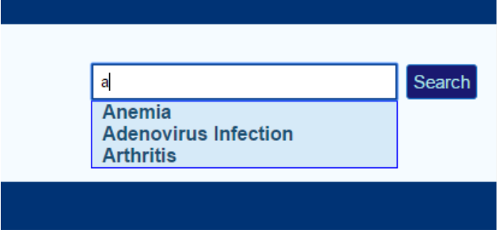
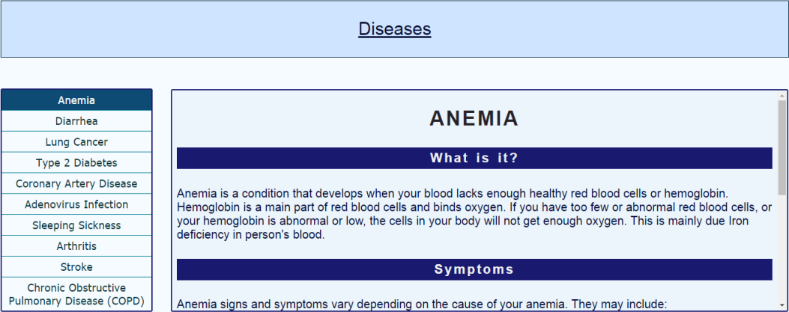
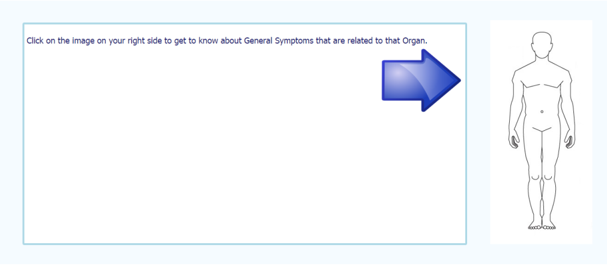

# Medical Information & Symptoms Analysis Website - MedicInfo

### Introduction

Aim of project is to develop a medical website which could operate for the
analysis of symptoms seen in patient (user); moreover it is also helpful to get
information about diseases and their respective medicines, with help of which
user can get knowledge of medicines about when and at what situation it can be
used.

For the development of this project languages used are:

* PHP
* HTML
* AJAX
* JAVASCRIPT
* CSS (Designing)

Front-hand is handled using html and JavaScript, by the use of which userinterface is handled like navigation bar for navigating between different
webpages, content handling and its display is also done by same. Creating popup forms, validation and different functions and are handled by JavaScript and
php. Ajax is used for search implementation and hints provided during
searching. Database is managed by MySQL using php commands. Data fetching
and storing and handling of data is done by php commands. Firstly navigation bar contains’ Diseases’,’ Medicines’ pages for information,
quizzes, home and symptom checker for analysing symptoms. Information of
medicines and diseases are stored in table in database from which it is fetched
and displayed, specifically in these two pages vertical navigation is given to
navigate between stack of medicines and diseases. Other than these’ Quizzes’
are just for enhancing the interaction with user by showing score and knowledge
awareness of particular information. As commonly followed ‘About us‘ page is
also included which gives overall short introduction of ours and our specialities.
In ‘Home’ page also our extra features like BMI calculation and symptoms
checking are mentioned which are designed by css. Apart from these for
‘Symptom checking’ page is operated by image mapping concept, which is
helpful for searching for diseases and connected to database accordingly.


### Hardware Requirements


### Software Requirements

For the development of this project languages used are:

* **PHP:** Used as a Server Side Scripting Language.
* **HTML:** Used to make the Body of the Web Page.
* **AJAX:** Prevent Re-loading of the page and saves time by showing
output on the same page.
* **JAVASCRIPT:** Used to make web pages dynamic, often used to
validate forms.
* **CSS (Designing):** Used to Design the Web Page.
* **XAMPP:** Used as an alternative to Apache Server and MySQL
database for accessing PHP scripts.
* **MySQL DATABASE:** Used to store information in forms of table as a
relational model, accessed by SQL Queries.

### Context Diagram


### Methodology

Here in this project we used HTML for the base structure of the pages, CSS for
styling them, JavaScript for dynamic working of the page, PHP for the server
side and AJAX a technique of JavaScript for implementing ‘Search’ and
‘Symptom Checker’.

1. **HOME-PAGE:**

Starting with the Home Page, we included two CSS file named ‘Header.css’
and ‘homepage.css’ these files contain the code for the styling of the page’s
top. Class ‘border’ defines border, ID ‘hints’ is used for the Search
implementation that becomes visible when the user type something on the
Search bar, ‘medictab’ defines the MedicInfo’s header, then the classes
‘dropdown’, ‘dropbtn’, ‘dropctn’ are all used to perform hover over the tabs.


2. **SEARCH IMPLEMENTATION:**

```
<form action="SearchResults.php" method="GET" autocomplete="off">
<input type="text" name="search" placeholder="Search Diseases..." size="30" onkeyup="showHints(this.value)"/>
<input type="submit" value="Search" />
</form>
```

This part of HTML code is used in every page where it requests to the
SearchResults.php to perform the action of finding the related query. Here on
some selected names can be searched that are in our database other than that all
queries will result in NOT FOUND. Each disease is given an ID, once the user
press enter that particular disease if exists in the database will get retrieved from
the database. Some Search suggestions will be given using AJAX that works on
behind of the page without reloading it for AJAX to occur we included
‘onkeyup’ event of JavaScript so whenever user presses a key and releases it the
suggestion appears in front of the user. Here AJAX send a XML Http Request
to the server which works on the responses coming from the server side, when a
response is ready to be given to the client readyState changes from 0 to 4 at 4 it
prints the result. Here status has to be 200 for loading the server page on back
side signifying page is present.

**AJAX:**

```
<!-- JAVASCRIPT FOR SEARCH SUGGESTIONS -->
<script type="text/javascript">
function showHints(str){
if(str.length == 0 || str == ""){
document.getElementById("hints").innerHTML="";
document.getElementById("hints").style.border="none";
document.getElementById("navigation").style.marginTop = "14px";
return;
}

else{
var xmlhttp = new XMLHttpRequest();
xmlhttp.onreadystatechange = function(){
if(this.readyState == 4 && this.status == 200){
document.getElementById("hints").innerHTML = this.responseText;
document.getElementById("hints").style.border = "1px solid blue";
document.getElementById("navigation").style.marginTop = "36px";
}
};

xmlhttp.open("GET", "SearchHints.php?q="+str, true);
xmlhttp.send();
}

</script>
```

PHP gets the result from AJAX and store it in $q then $q is converted to lower
string and then compared with the sub-string to the length of $q if a match is
found then it shows those matches otherwise prints ‘No Suggestion!’.



3. **DISEASE PAGE:**

Disease page deals with the 10 diseases listed on the page and using a frame for
displaying the result marking/highlighting the disease that is being displayed on the frame. This is done using the frame name and 10 HTML pages that are all
linked to the frame as a target through its name. When someone clicks the
vertical tabs, it links that page being called and displayed on the frame rather
loading a new page. The tabs on the left side gets highlighted showing the
current frame that is displaying on the page. This is done with the help of java
script that changes color when a link a pressed and keep all other thing same as
before. So for doing this it requires 10 such cases where this changes happens
therefore 10 times we have copy each thing then only changing the required link
color. This same goes for the Medicines page. 



4. **FEEDBACK FORM:**

We have included a feedback form for the users to rate our website, the details
given by the user will be recorded in a file. Data is send to the file through PHP
file handling and a person can easily view that file for references. Data from the
form will be entered (date will be generated by the server side independent of
the user’s position by using date() object) and PHP will take them as a POST
method so that it remains private. Name, Email, Age, Sex, Rating to our website
are all included in the form. The Result in the file will look like:

```
Date: 2016-10-19
Name: a a
Email id: a@c.com
Sex: male
Blood Group: B+
Experience: good
Rate: 6
Comments: abc
```

5. **SYMPTOM CHECKER:**

In symptom checker page concept of image mapping is applied. Image of
human body is shown and link is created to body’s each part like head, legs, etc.
So user clicks on the part in which user has suffering, this makes site more
interactive and does less tedious work. After this each & every link is connected
to database of information of diseases and symptoms of that part of body which
is displayed when user clicks body part.



### Conclusion

Project was successfully completed with proper implementation of languages
like php, JavaScript, html and css. By the means of this project we came to
know many new concepts and ideas i.e. implementing search by ajax, using
imagemapping concept for recognizing and analysing symptoms of user.

### Reference

* [W3School](www.w3schools.com)
* [Chennai Sunday - JS](http://www.chennaisunday.com/jsradio.html)
* [Itechies](http://www.itechies.net/tutorials/jscript/jsexample.php-pid-jform.htm)
* [PHP Easy Step](http://www.phpeasystep.com/phptu/6.html)
